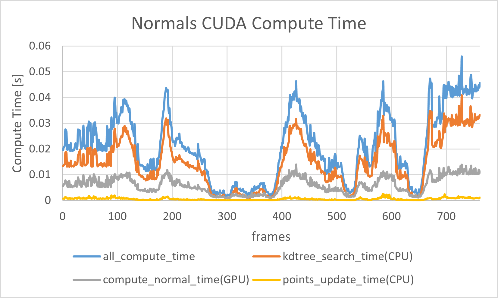
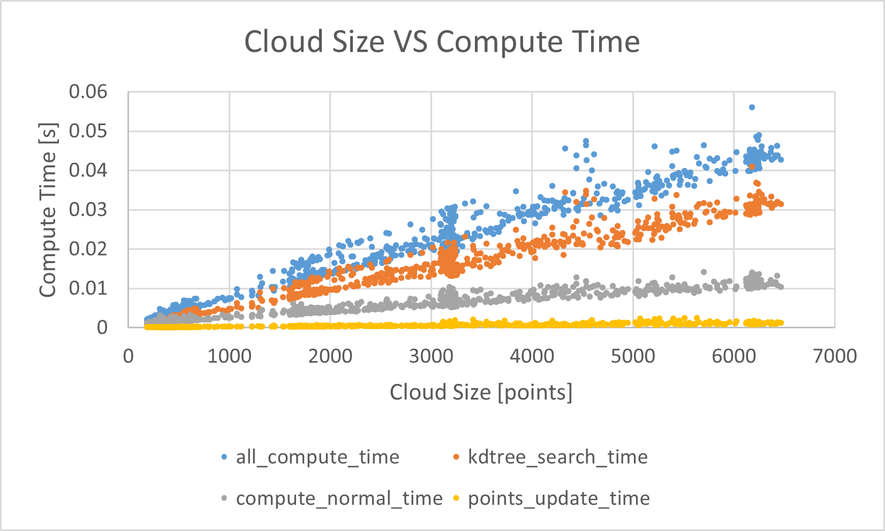

# CUDA-ROS
- min_cuda_node
    - rosにおけるcudaノードの最小構成
- cv_cuda
    - OpenCV×ROS×CUDAの環境構成
- eigen_cuda
    - 任意の数の点群を入力にして共分散行列を計算
    - ヤコビ法で固有ベクトル・固有値計算
- normal_cuda
    - 第三主成分軸を法線として出力
    - サンプル点群は指定した軸方向の分布が小さくなるようにランダムで生成
- normals_cuda
    - 点群の近傍点をPCLで探索(KDtree)
    - 各点毎にスレッドで法線計算
    - スレッド数制限(今回は32ThreadsPerBlock)
        - maxThreadsPerBlock: 512
        - maxThreadsDim: 512, 512, 64
        - モードによっては1Blockで計算できそう ([AzureKinectの解像度](https://github.com/7oei/Azure_Kinect_ROS_Driver/blob/48c8037285e91f0c08d5a9e9815444c85142cad1/docs/kinect.md))
# 参考
- CMake設定
    - [ROSをCUDA対応してみる](https://ipx.hatenablog.com/entry/2018/05/21/102659)
- CUDA実装
    - [CUDA プログラミング入門（フィックスターズ　飯塚編）](https://www.youtube.com/watch?v=dnuACytuVsU)
- 固有値計算
    - [ヤコビ(Jacobi)法](http://www.slis.tsukuba.ac.jp/~fujisawa.makoto.fu/cgi-bin/wiki/index.php?%B8%C7%CD%AD%C3%CD/%B8%C7%CD%AD%A5%D9%A5%AF%A5%C8%A5%EB#he7a28c3)

# 実行
- normals_cuda
    
    - launch
        ```
        roslaunch normals_cuda normals_cuda.launch 
        rosbag play /home/adachi/cross_progress_data/k4a_points.bag
        ```
- normal_cuda
    
    - launch
        ```
        roslaunch normal_cuda normal_cuda.launch
        ```
    - set param
        - x-axis
            ```
            rosparam set /normal/normal_cuda/axis 0
            ```
        - y-axis
            ```
            rosparam set /normal/normal_cuda/axis 1
            ```
        - z-axis
            ```
            rosparam set /normal/normal_cuda/axis 2
            ```

# 実行速度
- 条件
    - CPU : Intel(R) Core(TM) i7-7700HQ CPU @ 2.80GHz
    - GPU : NVIDIA Corporation GP107M [GeForce GTX 1050 Ti Mobile]
    - CUDA : 11.4
    - ROS : melodic
    - 前段VGFのLeafSize : 5cm
    - 屋内環境
- フレーム毎の計算時間

    

- 入力点群サイズに対する計算時間

    

- 結果
    - 18~500Hz